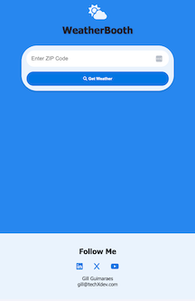
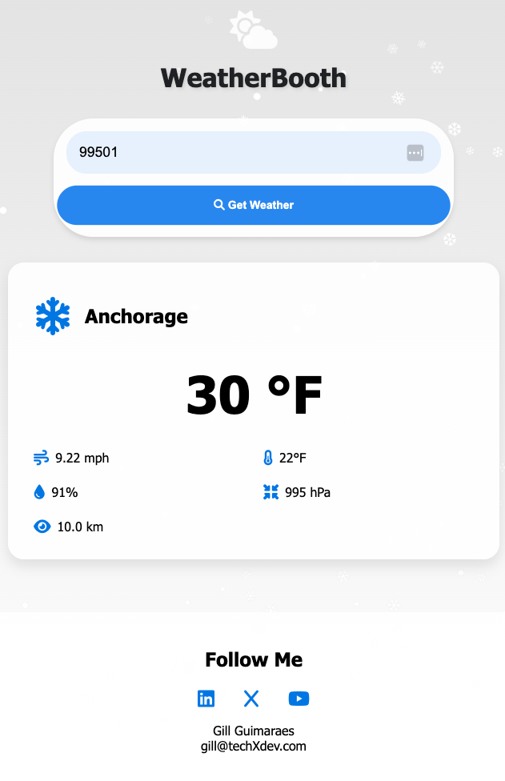
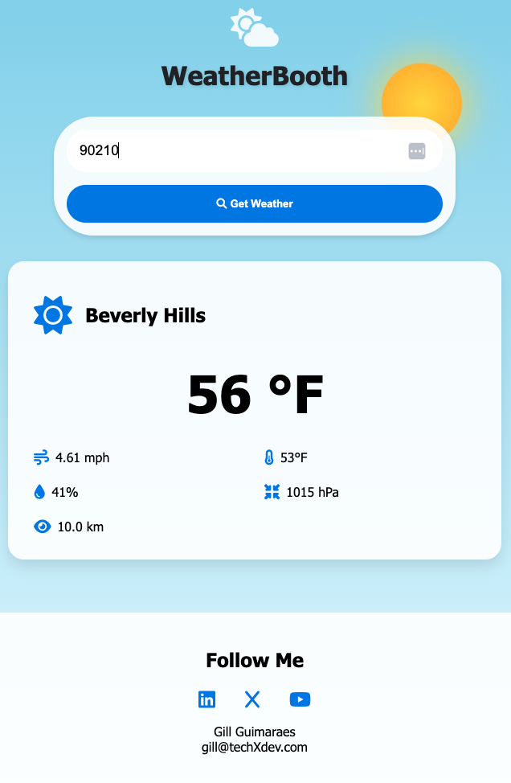

# WeatherBooth

**WeatherBooth** is a dynamic web application designed to provide real-time weather information through seamless API integration. Featuring a sleek, interactive user interface, WeatherBooth not only informs but also captivates with its unique styling and custom animations.

## Features

- **Real-Time Weather Data**: Up-to-the-minute weather conditions pulled directly from a reliable weather API.
- **Engaging Animations**: Custom animations add a visually appealing layer to the user experience.
- **Responsive Design**: Optimized for different devices, ensuring a smooth experience on desktop and mobile.
- **User-Friendly Interface**: Simple and intuitive design for easy navigation and quick access to weather updates.

todo: implement AI generated images in response to the weather pulled from api.
OpenAI API:
https://platform.openai.com/docs/guides/images/introduction
